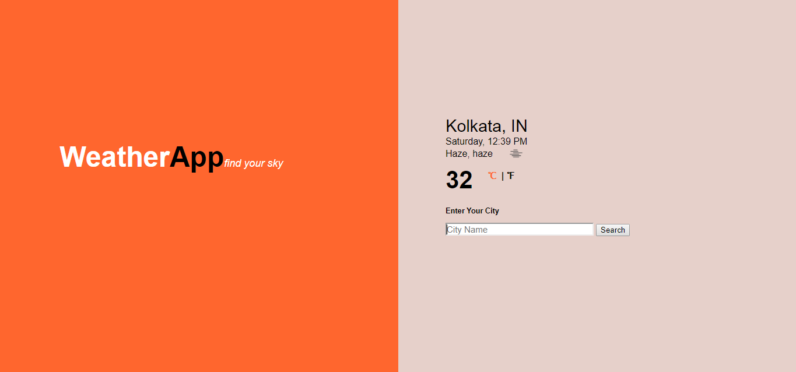
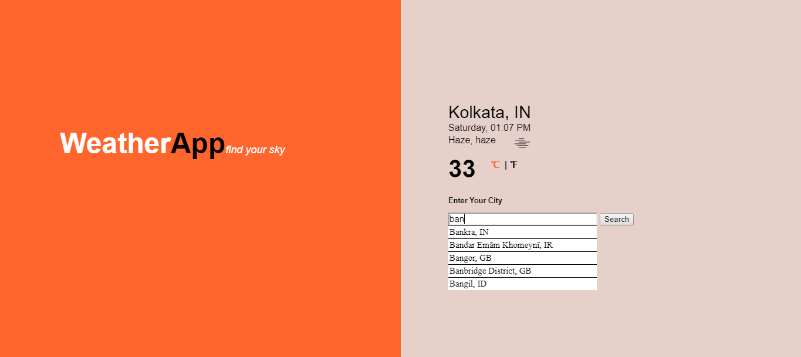
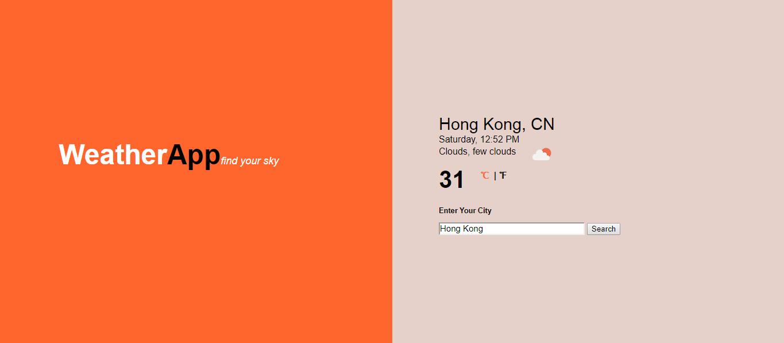

# WeatherAppUsingAPI
## Author:
Debarun Mitra
## Application name: 
Weather Report Application
## Technology used: 
 - HTML
 - CSS
 - JavaScript
 - Openweather API  
## Objective: 
A weather application to show the user current weather report of selected city .
## Visit:
[WeatherApplicationWithAPI]( https://debarunmitra.github.io/WeatherAppUsingAPI/)
## Screenshot:

#### +++++++++++++++++++++++++++++++++++++++++++++

#### +++++++++++++++++++++++++++++++++++++++++++++

